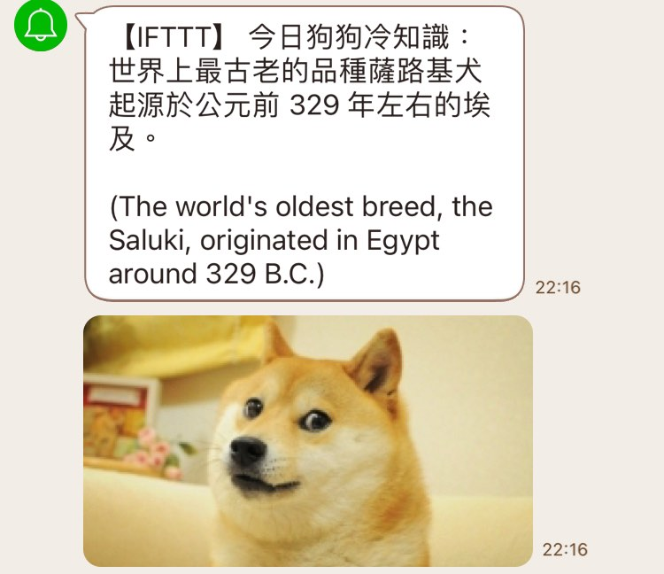

# 狗狗冷知識

## Demo

## Data
- [Dog API by kinduff](https://dogapi.dog/docs/api-v2)

## Note
- googletrans 套件
  - [[Python] 使用 googletrans 套件來進行 Google 翻譯
](https://clay-atlas.com/blog/2020/05/05/python-cn-note-package-googletrans-google-translate/)
  - 要手動升級到 3.1.0a0 才不會噴奇怪的錯誤 [(GitHub Issue)](https://github.com/ssut/py-googletrans/issues/366#issuecomment-1613824046)

