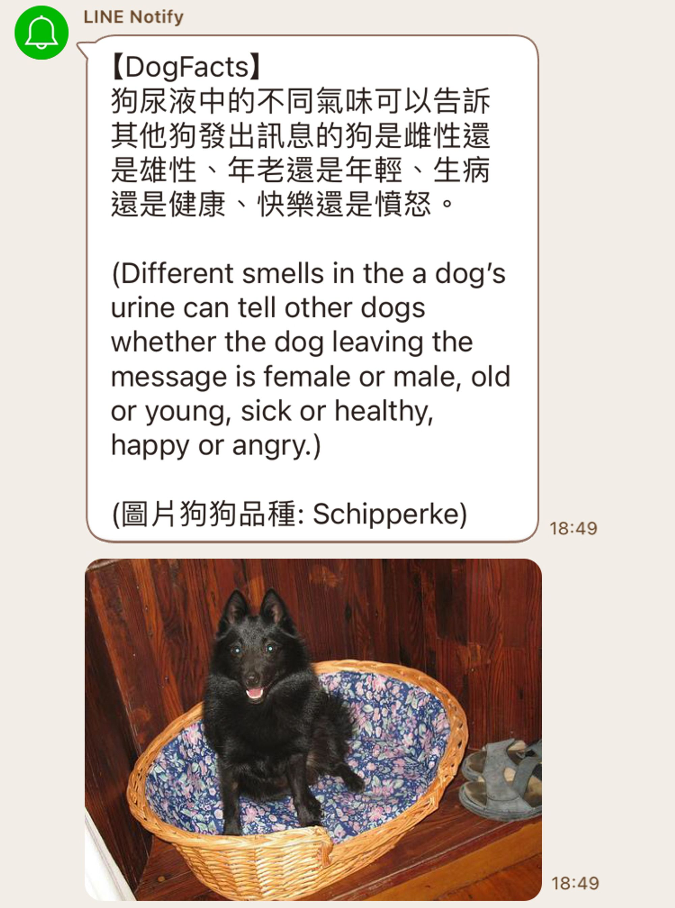

# 狗狗冷知識

## Demo


## Skills
- Python (requests, googletrans)
- LINE Notify API
- Google Cloud Platform (GCP cloud services)
  - Cloud Scheduler
  - Cloud Functions
  - Cloud Run
  - IAM (Service Account)

## Project Flow Chart


## Data
- [Dog API by kinduff](https://dogapi.dog/docs/api-v2)
- [Dog CEO (API)](https://dog.ceo/dog-api/)

## Note
- 部署到 GCP Cloud Functions 需要在 main.py 新增
  ```python
  import functions_framework

  ...

  @functions_framework.http
  def run(request):  # 記得要加 request 參數
    ...
    ...
  ``` 
- googletrans 套件
  - [[Python] 使用 googletrans 套件來進行 Google 翻譯
](https://clay-atlas.com/blog/2020/05/05/python-cn-note-package-googletrans-google-translate/)
  - 要手動升級到 3.1.0a0 才不會噴奇怪的錯誤 [(GitHub Issue)](https://github.com/ssut/py-googletrans/issues/366#issuecomment-1613824046)

